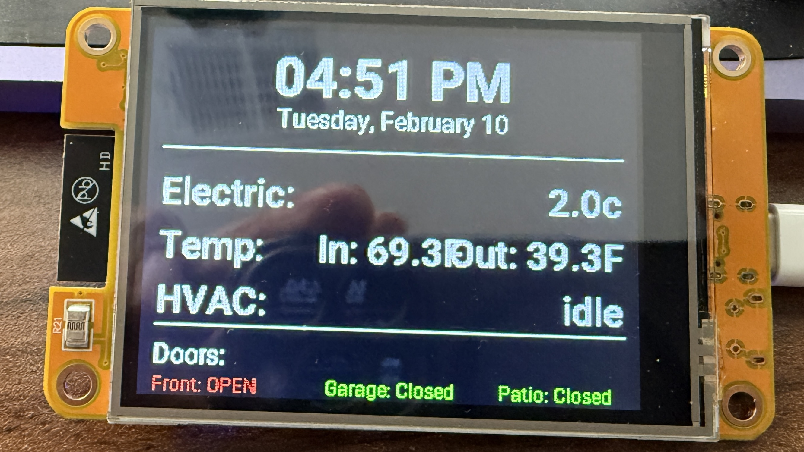

# ESP32 Desk Display - Home Telemetry Dashboard



## Goal

A compact ESP32 touchscreen that lives on my desk and shows real-time home telemetry without opening Home Assistant.

## Features

- **Current time + date** - Live synchronized with Home Assistant
- **Real-time ComEd electricity pricing** - 5-minute pricing updates
- **Indoor office temperature** - From SmartThings sensor
- **Outdoor "feels like" temperature** - Via OpenWeatherMap integration
- **HVAC action state** - Current heating/cooling status
- **Door status monitoring** - Front, garage, and patio door sensors
- **Tap screen to toggle display backlight** - Touch-enabled control
- **Onboard LED exposed to Home Assistant** - Additional control via HA

## Hardware

**ESP32 2.4" TFT touchscreen board** featuring:
- ILI9341 display driver
- XPT2046 touch controller
- 320x240 resolution
- Integrated backlight control

**Purchase Link:**
You can grab the same board here: https://amzn.to/4cBAFZ0

*Disclosure: I'm an Amazon affiliate, so I may earn from qualifying purchases.*

## Architecture

### Tech Stack
- **ESPHome** - Main firmware framework
- **Home Assistant API** - Native ESPHome integration
- **OpenWeatherMap** - Weather data provider
- **SmartThings** - Temperature sensor integration
- **ComEd** - 5-minute pricing sensor
- **Binary contact sensors** - Door status monitoring

### Design Philosophy

Everything is pulled live from Home Assistant via the native ESPHome API integration.

**No MQTT. No polling hacks. Just direct entity imports.**

The display updates automatically when entity states change in Home Assistant, providing real-time telemetry data.

## Deployment to Home Assistant

### Prerequisites

1. **Home Assistant** with ESPHome add-on installed
2. **Required Home Assistant integrations:**
   - OpenWeatherMap (for outdoor temperature)
   - SmartThings (for office temperature sensor)
   - ComEd integration (for electricity pricing)
   - Binary sensors configured for doors

3. **Required entity IDs in Home Assistant:**
   - `sensor.comed_5_minute_price` - ComEd pricing sensor
   - `sensor.openweathermap_feels_like_temperature` - Outdoor temp
   - `sensor.smartthings_button_temperature` - Office temp
   - `climate.great_room` - HVAC thermostat
   - `binary_sensor.front_entrance_contact` - Front door
   - `binary_sensor.garage_entrance_contact` - Garage door
   - `binary_sensor.patio_entrance_contact` - Patio door

### Installation Steps

#### 1. Create secrets.yaml

Create a `secrets.yaml` file in your ESPHome configuration directory:

```yaml
wifi_ssid: "YourWiFiSSID"
wifi_password: "YourWiFiPassword"
api_encryption_key: "your-32-character-api-key-here"
```

Generate the API encryption key using ESPHome:
```bash
esphome wizard esp-display.yml
```

#### 2. Download Required Fonts

Download the Roboto font family and place in your ESPHome directory:
- Roboto-Bold.ttf
- Roboto-Medium.ttf
- Roboto-Regular.ttf

You can download these from [Google Fonts](https://fonts.google.com/specimen/Roboto).

#### 3. Customize Entity IDs

Edit `esp-display.yml` and replace the entity IDs with your own Home Assistant entities:

```yaml
sensor:
  - platform: homeassistant
    id: comed_price
    entity_id: sensor.YOUR_ELECTRICITY_PRICE_SENSOR

  - platform: homeassistant
    id: outdoor_temp
    entity_id: sensor.YOUR_OUTDOOR_TEMP_SENSOR

  - platform: homeassistant
    id: office_temp
    entity_id: sensor.YOUR_INDOOR_TEMP_SENSOR

text_sensor:
  - platform: homeassistant
    id: hvac_state
    entity_id: climate.YOUR_THERMOSTAT
    attribute: hvac_action

binary_sensor:
  - platform: homeassistant
    id: front_door
    entity_id: binary_sensor.YOUR_FRONT_DOOR

  - platform: homeassistant
    id: garage_door
    entity_id: binary_sensor.YOUR_GARAGE_DOOR

  - platform: homeassistant
    id: patio_door
    entity_id: binary_sensor.YOUR_PATIO_DOOR
```

#### 4. Flash the ESP32

**First Time Setup (USB):**

1. Connect the ESP32 to your computer via USB
2. Install the firmware:
   ```bash
   esphome run esp-display.yml
   ```
3. Select the USB port when prompted
4. Wait for compilation and upload to complete

**Subsequent Updates (OTA):**

After initial setup, you can update wirelessly:
```bash
esphome run esp-display.yml
```
Select the network device when prompted.

#### 5. Add to Home Assistant

1. The device should be automatically discovered by Home Assistant
2. Navigate to **Settings** → **Devices & Services** → **ESPHome**
3. Click **Configure** on the discovered device
4. Enter your API encryption key
5. The device will be added and all sensors/controls will be available

### Controls Available in Home Assistant

Once deployed, these entities will appear in Home Assistant:

- `light.display_backlight` - Control display brightness
- `light.board_led` - Control onboard LED
- `button.restart` - Restart the ESP32
- `sensor.wifi_signal` - WiFi signal strength
- `sensor.uptime` - Device uptime in hours

## Configuration

The display configuration is defined in `esp-display.yml`. Key components:

### Display Layout
- **Header:** Time and date centered at top
- **Row 1:** Electricity price
- **Row 2:** Indoor and outdoor temperatures
- **Row 3:** HVAC status
- **Row 4:** Door statuses with color coding (red=open, green=closed)

### Touch Configuration
- Single tap anywhere on screen toggles the backlight
- Touch sensitivity calibrated for XPT2046 controller
- 50ms update interval for responsive touch

### Update Intervals
- Display: 5 seconds
- WiFi signal: 60 seconds
- Touchscreen: 50ms

## Customization

### Modify Display Layout

Edit the `lambda` section in the `display:` component of `esp-display.yml` to customize what's shown and where.

### Add More Sensors

Add additional Home Assistant sensors using the same pattern:

```yaml
sensor:
  - platform: homeassistant
    id: my_sensor
    entity_id: sensor.my_entity_id
```

Then reference in the display lambda: `id(my_sensor).state`

### Change Fonts

Replace the font files or adjust sizes in the `font:` section:

```yaml
font:
  - file: "YourFont.ttf"
    id: font_custom
    size: 20
```

## Troubleshooting

**Display not showing:** Check SPI pins match your hardware configuration
**Touch not working:** Verify XPT2046 calibration values in touchscreen section
**Sensors showing unavailable:** Ensure entity IDs match your Home Assistant configuration
**WiFi connection issues:** Verify secrets.yaml credentials are correct

## License

This project is licensed under the Apache License 2.0 - see the LICENSE file for details.

## Acknowledgments

Built with ESPHome and integrated with Home Assistant for seamless home automation monitoring.
